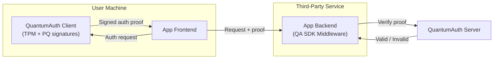
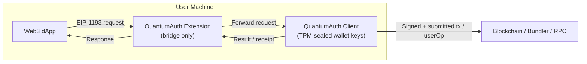
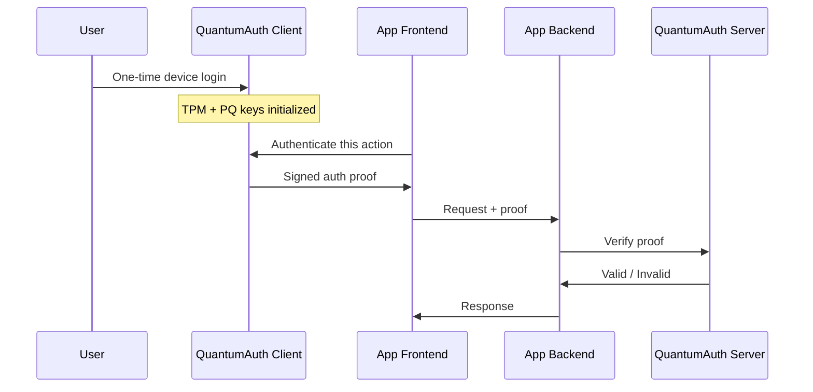
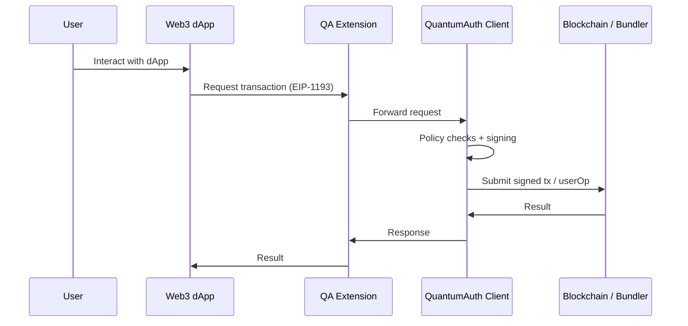

QuantumAuth provides **passwordless, device-bound authentication and wallet infrastructure** rooted in secure hardware.

Users authenticate **once** on their own machine using the QuantumAuth Client. From that point on, applications and Web3 dApps can rely on the QuantumAuth platform to authenticate user actions and authorize transactions — **without login forms, passwords, browser wallets, seed phrases, or token logic**.

Authentication and signing are removed from applications and browsers and handled locally by trusted device software.

---

## Core Components

QuantumAuth is composed of four main components:

- **QuantumAuth Client**  
  Runs on the user’s machine. Anchored to the TPM and responsible for all cryptographic operations.

- **QuantumAuth Browser Extension**  
  A secure bridge between the browser and the local client. Holds no keys.

- **QuantumAuth Server**  
  Central verification, policy, and identity service.

- **QuantumAuth SDK**  
  Middleware and helpers used by third-party backends (and optionally frontends).

---

## High-Level Architecture (Authentication)

---

## High-Level Architecture (Wallet & Web3)

---

## Component Details

### QuantumAuth Client (User Device)

The QuantumAuth Client is the **root of trust**.

Responsibilities:

- Performs the **one-time local login** on the device
- Generates and manages **TPM-backed key material**
- Seals authentication and wallet keys inside the TPM
- Produces:
  - Authentication proofs
  - Wallet transaction signatures
- Exposes a **local API** (e.g. `http://localhost:6137`) used by frontends and the extension

Key properties:

- Private keys are **non-exportable**
- All signing happens locally
- No secrets ever reach the browser or applications

---

### QuantumAuth Browser Extension (Secure Bridge)

The extension is **not a wallet** and **not a key store**.

It does **not**:
- Store private keys
- Generate signatures
- Hold seed phrases or secrets

Responsibilities:

- Acts as a secure bridge between browser contexts and the local client
- Forwards EIP-1193 requests to the QuantumAuth Client
- Enforces origin and request integrity
- Prevents direct key access from JavaScript

This removes the browser as a trust boundary.

---

### QuantumAuth Server

The QuantumAuth Server is the global verification and policy authority.

Responsibilities:

- Verifies TPM-backed, PQ-signed authentication proofs
- Maintains device ↔ user associations
- Applies authentication and policy rules
- Returns a simple **valid / invalid** decision to third-party backends

The server:

- Never receives passwords
- Never stores private keys
- Does not issue session or refresh tokens
- Exists only to **verify proofs and enforce policy**

---

### QuantumAuth SDK

The QuantumAuth SDK is used by third-party developers.

**Backend responsibilities:**

- Middleware to intercept incoming requests
- Extracts QuantumAuth proofs
- Canonicalizes requests
- Verifies proofs via the QuantumAuth Server
- Attaches authenticated identity to request context

**Frontend helpers (optional):**

- Utilities to call the local QuantumAuth Client
- Helpers for attaching proofs to backend requests

---

## End-to-End Authentication Flow

---

## End-to-End Wallet Flow (Account Abstraction)

---

## Security Properties

QuantumAuth provides:

- **Hardware-rooted identity**  
  TPM-sealed, non-exportable keys.

- **Post-quantum cryptography**  
  Authentication and signing designed to remain secure against quantum adversaries.

- **No passwords or seed phrases**  
  Nothing to steal, leak, or phish.

- **No browser-based key material**  
  Browsers never hold private keys.

- **No token lifecycle management**  
  Each request is verified independently.

- **Account Abstraction–ready**  
  Supports smart accounts, policies, recovery, and multi-factor execution.

---

## Summary

QuantumAuth moves authentication and wallet security **out of applications and browsers** and anchors them directly in trusted device hardware.

- Users authenticate **once** on their device
- Apps rely on verified, device-bound proofs
- Wallets operate without seed phrases or browser keys
- Developers focus on business logic, not security plumbing