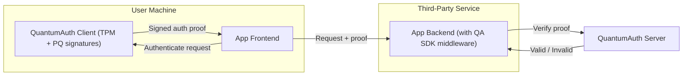
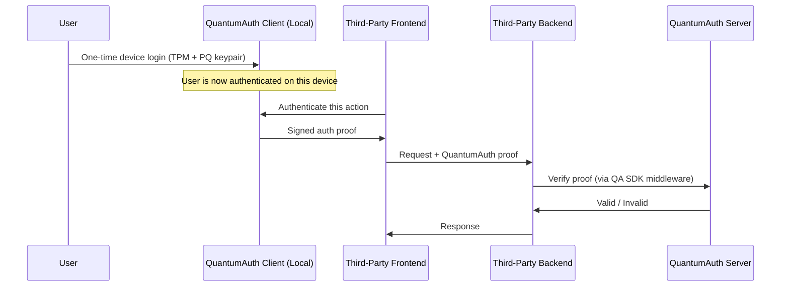

QuantumAuth provides **formless, passwordless, device-bound authentication**.

Instead of users logging into each application, they authenticate **once** on their own machine using the QuantumAuth Client. From that point on, any participating application can rely on the QuantumAuth platform to authenticate user actions, without implementing login forms, password storage, or token logic.

QuantumAuth is composed of three main components:

- **QuantumAuth Client** – runs on the user’s machine, anchored to the TPM and using post-quantum (PQ) signatures.
- **QuantumAuth Server** – central verification and policy service.
- **QuantumAuth SDK** – middleware and helpers for third-party backends and frontends.

---

## High-Level Architecture

---

## Components

### QuantumAuth Client (User Device)

The QuantumAuth Client runs locally on the user’s machine and is the root of identity.

Responsibilities:

- Performs the **initial login** on the device (user signs in once).
- Generates and manages **TPM-backed key pairs**.
- Produces **post-quantum signatures** for authenticated actions.
- Exposes a **local HTTP API** (for example `http://localhost:8090`) that frontends can call to authenticate a request.

Key properties:

- Private keys **never leave the TPM**.
- All authentication proofs are signed locally.
- Once the user is logged into the Client, they do not need to log in again for each application on that device.

---

### QuantumAuth Server

The QuantumAuth Server is the global verification authority.

Responsibilities:

- Validates TPM-backed, PQ-signed authentication proofs from user devices.
- Associates device-bound identities with QuantumAuth accounts.
- Applies security and access policies.
- Returns a simple **valid / invalid** decision to third-party backends.

The server:

- Never receives or stores passwords.
- Does not issue or manage traditional session or refresh tokens.
- Focuses on **verifying proofs**, not on handling secrets.

---

### QuantumAuth SDK

The QuantumAuth SDK is used by third-party developers in their backends (and optionally frontends).

**Backend responsibilities:**

- Provides **middleware** that intercepts incoming requests.
- Extracts the QuantumAuth proof attached by the frontend.
- Sends the proof to the QuantumAuth Server for verification.
- Marks the request as authenticated (with attached user/device identity) if the proof is valid.

**Frontend responsibilities (optional helpers):**

- Provides utilities to call the local QuantumAuth Client from the browser or native app.
- Attaches the QuantumAuth proof to outgoing requests to the third-party backend.

---

## End-to-End Request Flow

At a high level, the interaction between the different parts looks like this:

---

## Security Properties

QuantumAuth is designed to provide:

- **Hardware-rooted identity**  
  Keys are generated and stored in the TPM; private keys are non-exportable.

- **Post-quantum secure signatures**  
  Authentication proofs are signed with PQ-safe algorithms, resilient to both classical and quantum attacks.

- **No passwords, no login forms**  
  Users authenticate once with the QuantumAuth Client on their device. Applications never handle credentials.

- **No token management**  
  Third-party services do not need to issue, store, or refresh tokens. They simply verify each request with the QuantumAuth Server through the SDK.

- **Invisible authentication for users**  
  Application UX is simplified: no login screens, no account creation flows, just trusted, device-bound actions.

---

## Summary

QuantumAuth moves authentication away from individual applications and into a dedicated platform built on TPM-backed, post-quantum cryptography.

- Users log in **once** on their own machine.
- Frontends talk to the **QuantumAuth Client** to authenticate requests.
- Third-party backends rely on the **QuantumAuth SDK** and **QuantumAuth Server** to validate those requests.
- Developers focus on business logic instead of building and maintaining fragile authentication systems.