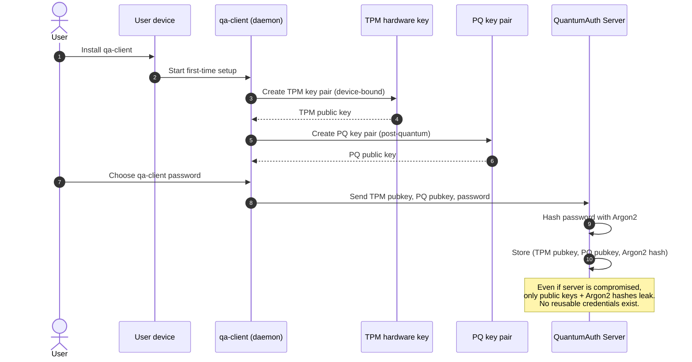
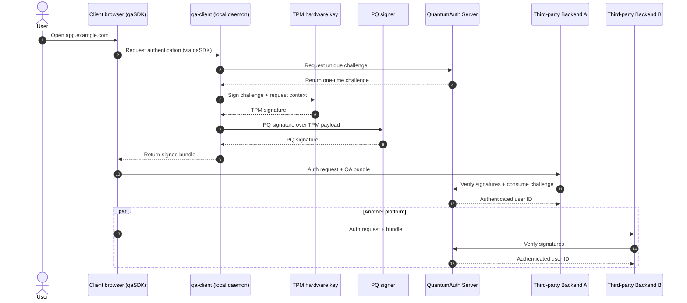
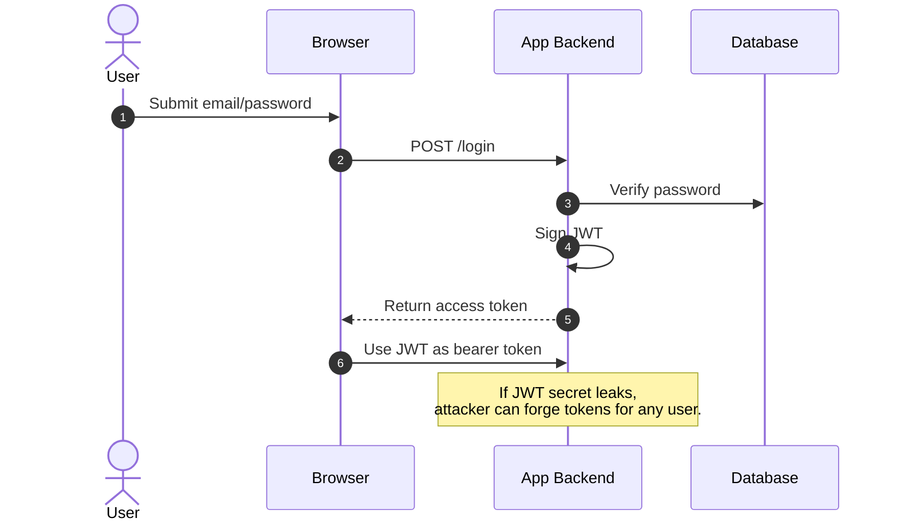
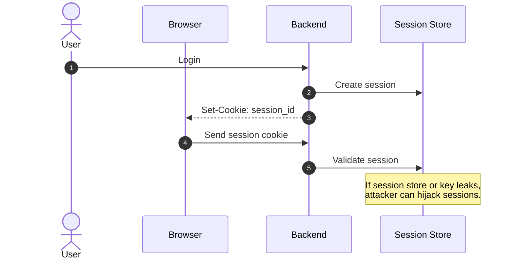
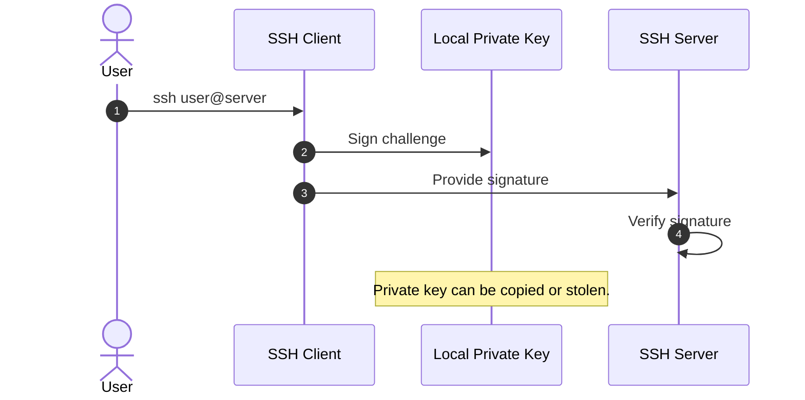

# Why QuantumAuth?

QuantumAuth is an **open-source**, hardware-anchored authentication layer that eliminates passwords, bearer tokens, refresh tokens, and user-managed keys.  
It binds identity to **TPM hardware**, a **post-quantum signature layer**, and a **device-local daemon**, ensuring that no third-party platform ever stores credentials that can be reused or stolen.

QuantumAuth delivers:

- **No single point of failure**
- **Credential-less authentication** for third-party platforms
- **Hardware-bound identity** (TPM keys cannot be exported)
- **Post-quantum security** through additional signature layers
- **Attack resistance** even if the QuantumAuth server or a third-party backend is fully compromised

---

## 1. Device Enrollment (One-Time Setup)

---

## 2. Transparent Authentication Workflow

### Guarantees

- No single point of failure  
- No credentials stored on third-party systems  
- TPM private keys cannot be exported  
- PQ signatures add a post-quantum layer  

To compromise one account, an attacker must have:

- Physical access to the device  
- OS/device credentials  
- The qa-client password  
- Ability to send requests from that device  

---

## 3. Comparison With Classic Authentication

### JWT Authentication

---

### Session-Based Authentication

---

### SSH Key Authentication

---

## 4. Why QuantumAuth is Different

Traditional authentication mechanisms rely on **shared secrets, tokens, or user-managed private keys**.  
QuantumAuth replaces all of these with:

### ✔ Hardware-bound identity  
TPM keys never leave the device.

### ✔ Post-quantum layered signatures  
Break one layer, still can't impersonate.

### ✔ Zero credentials stored on third-party platforms  
Nothing to steal, dump, or leak.

### ✔ Server compromise is not enough  
Public keys + Argon2 hashes are useless without the real device.

QuantumAuth shifts authentication from:

> **“Whoever has the token wins”**  
to  
> **“Only the legitimate device + user can ever produce a valid signature.”**

---

